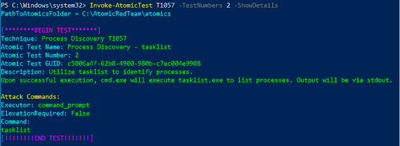
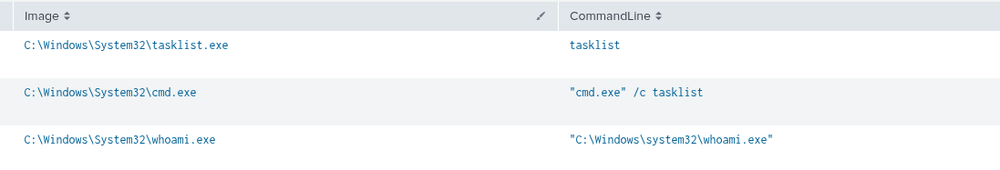
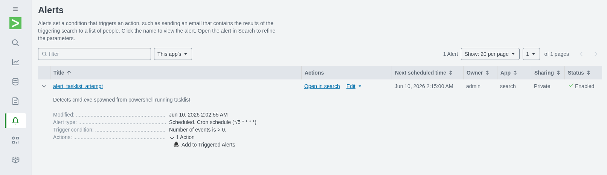
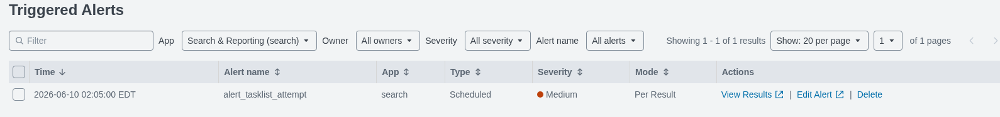

# test-02-tasklist

| Field | Details |
| --- | --- |
| **Date** | 2026-06-10 |
| **Test** | #2 - Process Discovery via tasklist |
| **Tactic** | Discovery |
| **Result** | Detected |

---

## 1. Test Number Overview

An attacker enumerates running processes on the victim machine to gather
information about what software and security tools are active. This is
reconnaissance, the attacker is building a picture of the environment
before deciding their next move (such as weaponizing). Knowing what is
running helps them avoid detection tools and identify high-value targets
like lsass.exe for credential dumping.




*(revealed this after the analysis was done)*

---

## 2. Hypothesis

| Field | Expected |
| --- | --- |
| **Process** | tasklist.exe spawned by cmd.exe |
| **Parent chain** | powershell.exe → cmd.exe → tasklist.exe |
| **Command line** | cmd.exe /c tasklist |
| **Event codes** | EventCode=1 (process creation) |

**Expected search:**

```
index=main source="WinEventLog:Microsoft-Windows-Sysmon/Operational"
host="DESKTOP-9KP1CU3" EventCode=1 CommandLine="*tasklist*"
```

---

## 3. Execution of Atomic Red Team to start the scenario

| Field | Details |
| --- | --- |
| **Command** | `Invoke-AtomicTest T1057 -TestNumbers 2` |
| **Exit code** | 0 (success) |
| **Issues** | None |

---

## 4. What Splunk Found

| Field | Value |
| --- | --- |
| **Image** | C:\Windows\System32\tasklist.exe |
| **CommandLine** | tasklist |
| **ParentImage** | C:\Windows\System32\cmd.exe |
| **ParentCommandLine** | cmd.exe /c tasklist |
| **User** | DESKTOP-9KP1CU3\SOC101 |
| **Timestamp** | 2026-06-10 00:45:51 |
| **Event codes triggered** | EventCode 1 (process create) |

**Working search:**

```
index=main source="WinEventLog:Microsoft-Windows-Sysmon/Operational"
host="DESKTOP-9KP1CU3" EventCode=1
| where NOT match(Image, "(?i)splunk")
| table _time, Image, CommandLine, ParentImage, ParentCommandLine
| reverse
```

**Screenshot:**

Result of the query:



---

## 5. Hypothesis vs Reality

|  | Notes |
| --- | --- |
| **Got right** | Correctly predicted tasklist.exe, cmd.exe, and powershell.exe would be involved. Parent-child chain matched expectations. |
| **Got wrong** | Expected a bigger or more dramatic attack footprint. Discovered that T1057 is a simple recon, it only generates process creation events because tasklist is a local command with no network or file activity. |
| **Unexpected** | Volume of background noise in Splunk. Filtering is a core skill, a MUST. Real SOC analysts spend significant time tuning searches to cut noise. |

---

## 6. Detection Rule

**Trigger logic:**

| Field | Value |
| --- | --- |
| **ParentImage** | `*powershell.exe*` |
| **Image** | `*cmd.exe*` |
| **CommandLine** | `*tasklist*` |

**Detection search:**

```
index=main host="DESKTOP-9KP1CU3"
source="WinEventLog:Microsoft-Windows-Sysmon/Operational" EventCode=1
ParentImage="*powershell.exe*" Image="*cmd.exe*" CommandLine="*tasklist*"
```

**False positive risk:** 

Low: legitimate software rarely chains 

powershell → cmd → tasklist. Worth investigating every time it fires.

**Alert configuration:**

| Setting | Value |
| --- | --- |
| **Name** | alert_tasklist_attempt |
| **Schedule** | Every 5 mins or `*/5 * * * *` |
| **Lookback** | Last 15 minutes |
| **Trigger** | Number of results > 0, per result |
| **Severity** | Medium |
| **Mode** | Per Result |
| **Confirmed firing** | 2026-06-10 02:05:00 |

**Screenshots:** 

Alert:



Alert Triggered:



---

## 7. Cleanup + Next Steps

**Cleanup:**

```powershell
Invoke-AtomicTest T1057 -TestNumbers 2 -Cleanup
```

## 8. Takeways

Though the first test is a little uneventful, this marks my first own lab on using Splunk. I was able to apply what I learned on the courses I took such as navigating the splunk, configuring the query for better results and making an alert. Excited for what is more to come.
