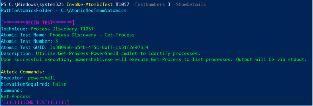

# test-03-Get-Process

| Field | Details |
| --- | --- |
| **Date** | 2026-06-11 |
| **Test** | #3 - Process Discovery via Get-Process |
| **Tactic** | Discovery |
| **Result** | Detected |

---

## 1. Test Number Overview

This test demonstrates process discovery via PowerShell's `Get-Process` cmdlet. Atomic Red Team executes it by spawning a child PowerShell process from a parent PowerShell session, resulting in a PowerShell-spawns-PowerShell pattern visible in Sysmon logs.



*(revealed this after the analysis was done)*

---

## 2. Hypothesis

| Field | Expected |
| --- | --- |
| **Process** | A child PowerShell process will be spawned by the parent PowerShell session |
| **Parent chain** | powershell.exe → powershell.exe |
| **Command line** | Get-Process visible in CommandLine |
| **Event codes** | EventCode=1 (process creation) |

**Expected search:**

```
index=main host="DESKTOP-9KP1CU3"
source="WinEventLog:Microsoft-Windows-Sysmon/Operational"
EventCode=1 CommandLine="*Get-Process*"
```

---

## 3. Execution of Atomic Red Team to start the scenario

| Field | Details |
| --- | --- |
| **Command** | `Invoke-AtomicTest T1057 -TestNumbers 3` |
| **Exit code** | 0 (success) |
| **Issues** | None |

---

## 4. What Splunk Found

| Field | Value |
| --- | --- |
| **Image** | C:\Windows\System32\WindowsPowerShell\v1.0\powershell.exe |
| **CommandLine** | "powershell.exe" & {Get-Process} |
| **ParentImage** | C:\Windows\System32\WindowsPowerShell\v1.0\powershell.exe |
| **ParentCommandLine** | "C:\Windows\System32\WindowsPowerShell\v1.0\powershell.exe" |
| **User** | DESKTOP-9KP1CU3\SOC101 |
| **Event codes triggered** | EventCode 1 (process create) |

**Detection search:**

```
index=main host="DESKTOP-9KP1CU3"
source="WinEventLog:Microsoft-Windows-Sysmon/Operational" CommandLine="*Get-Process*" 
| where NOT match(Image, "(?i)splunk")
```

**Screenshots:**

Query Result:


Log Contents:


---

## 5. Findings and Expectations

As stated on the hypothesis the use of nested exes happened in one certain log that has event code 1. A child PowerShell process (Image) was spawned by a parent PowerShell process (ParentImage), with `Get-Process` visible in the CommandLine. The `CurrentDirectory` being `C:\Users\SOC101\AppData\Local\Temp\` was an unexpected finding — worth flagging as a behavioral indicator in production.

---

## 6. Detection Rule

**Trigger logic:**

| Field | Value |
| --- | --- |
| **Image** | `*powershell.exe*` |
| **ParentImage** | `*powershell.exe*` |
| **CommandLine** | `*Get-Process*` |

**Detection search:**

```
index=main host="DESKTOP-9KP1CU3"
source="WinEventLog:Microsoft-Windows-Sysmon/Operational" EventCode=1 CommandLine="*Get-Process*" ParentImage="*powershell.exe*" Image="*powershell.exe*"
```

**False positive risk:**
Medium: `Get-Process` is a common cmdlet. In production, this alert would be low-confidence without additional context. 

**Alert configuration:**

| Setting | Value |
| --- | --- |
| **Name** | alert_get-process_attempt |
| **Schedule** | Every 5 mins or `*/5 * * * *` |
| **Lookback** | Last 15 minutes |
| **Trigger** | Number of results > 0, per result |
| **Severity** | Medium |
| **Mode** | Per Result |

**Screenshots:**

Alert:


Alert Triggered:


---

## 7. Cleanup + Next Steps

**Cleanup:**

```powershell
Invoke-AtomicTest T1057 -TestNumbers 3 -Cleanup
```

---

## 8. Takeaways
PowerShell spawning another PowerShell is the part that stood out to me most. In a normal environment, that is not really something admins do on purpose, if you wanted to run `Get-Process`, you just run it in your current session, not open a whole new PowerShell just to do it. So seeing Image and ParentImage be the exact same binary is already a little weird on its own. The `AppData\Local\Temp directory` adds to that, legit scripts usually live somewhere structured like `C:\Scripts` or get run straight from System32, not from a temp folder buried in a user profile, which is exactly the kind of behavior Atomic Red Team does.


On its own, Get-Process doesn't mean much, it's one of the most common cmdlets out there, so alerting on that alone would be way too noisy in a real environment. But when you stack it together, same binary spawning itself, running from Temp, at High integrity, that combination is what actually makes it worth a second look. None of these things alone would get my attention, but together they tell a more suspicious story because of the sequence
