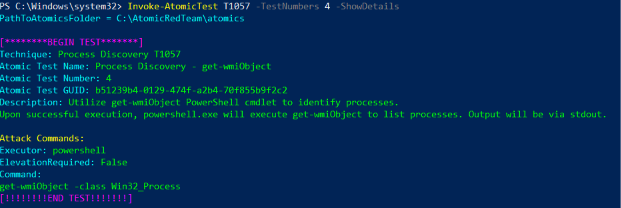
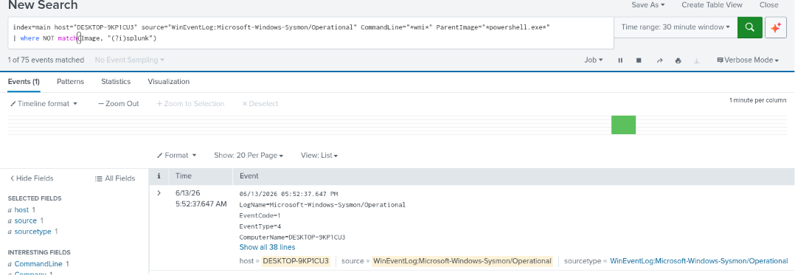
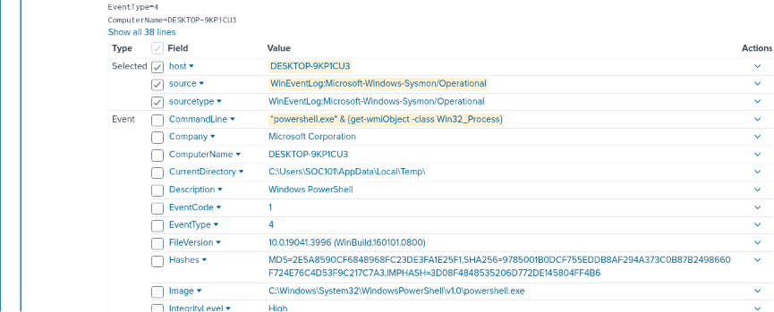
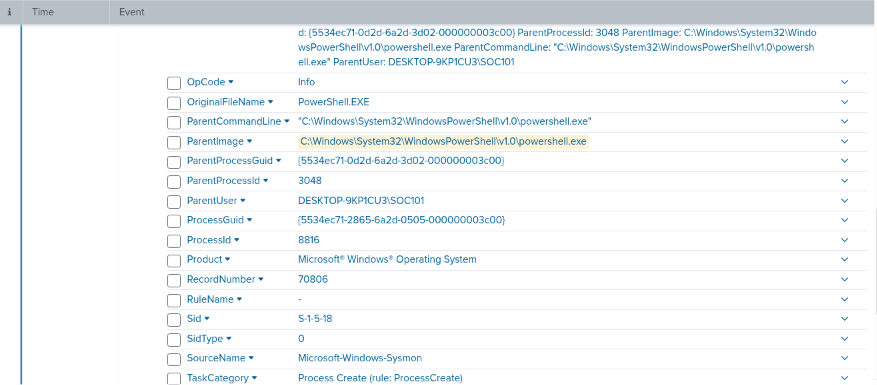
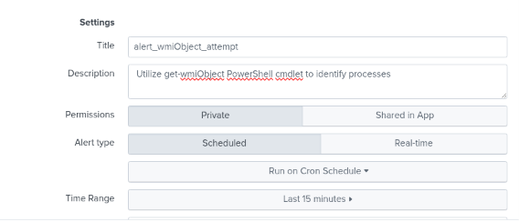
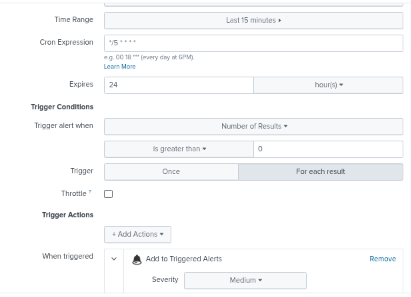

# test-04-wmiObject

# T1057-Process-Discovery

| Field | Details |
| --- | --- |
| **Date** | 2026-06-13 |
| **Test** | #4 - Process Discovery via Get-WmiObject |
| **Tactic** | Discovery |
| **Result** | Detected |

---

## 1. Test Overview

This test uses the `Get-WmiObject` PowerShell cmdlet to query `Win32_Process` and list running processes. Since `wmi` is in the name, I initially thought this would involve `wmic.exe` like Test 5, but `Get-WmiObject` is actually a PowerShell cmdlet that talks to WMI directly,no separate binary needed. Based on Test 3, my guess is this will look similar (powershell spawning powershell).



---

## 2. Hypothesis

| Field | Expected |
| --- | --- |
| **Process** | powershell.exe spawn another powershell.exe, same as test 3 |
| **Parent chain** | powershell.exe → powershell.exe |
| **Command line** | get-wmiObject -class Win32_Process, maybe wmic.exe will show up too since the name has "wmi" in it |
| **Event codes** | EventCode=1 (process creation) |

**Expected search:**

```
index=main host="DESKTOP-9KP1CU3"
source="WinEventLog:Microsoft-Windows-Sysmon/Operational"
EventCode=1 CommandLine="*wmi*"
```

---

## 3. Execution

| Field | Details |
| --- | --- |
| **Command** | `Invoke-AtomicTest T1057 -TestNumbers 4` |
| **Exit code** | 0 (success) |
| **Issues** | None |

---

## 4. What Splunk Found

| Field | Value |
| --- | --- |
| **Image** | C:\Windows\System32\WindowsPowerShell\v1.0\powershell.exe |
| **CommandLine** | "powershell.exe" & {get-wmiObject -class Win32_Process} |
| **ParentImage** | C:\Windows\System32\WindowsPowerShell\v1.0\powershell.exe |
| **ParentCommandLine** | "C:\Windows\System32\WindowsPowerShell\v1.0\powershell.exe" |
| **User** | DESKTOP-9KP1CU3\SOC101 |
| **CurrentDirectory** | C:\Users\SOC101\AppData\Local\Temp\ |
| **IntegrityLevel** | High |
| **Timestamp** | 2026-06-13 05:52:37.647 PM |
| **Event codes triggered** | EventCode 1 (process create) |

**Detection search:**

```
index=main host="DESKTOP-9KP1CU3"
source="WinEventLog:Microsoft-Windows-Sysmon/Operational" CommandLine="*wmi*"
| where NOT match(Image, "(?i)splunk")
```

**Screenshots:**

Query result:



Log detail:





---

## 5. Findings and Expectations

Half of hypothesis was right - powershell.exe spawned another powershell.exe again, same pattern as Test 3. But I was wrong about wmic.exe showing up, `Get-WmiObject` is a cmdlet only, it does not call `wmic.exe` as a separate process. So even though, both have "wmi" in the name, they are not related on the process level. Also CurrentDirectory is again `AppData\Local\Temp`, so that is now 3 out of 4 tests (3, 4, 5) with the same directory pattern.

---

## 6. Detection Rule

**Trigger logic:**

| Field | Value |
| --- | --- |
| **Image** | `*powershell.exe*` |
| **ParentImage** | `*powershell.exe*` |
| **CommandLine** | `*wmi*` |

**Detection search:**

```
index=main host="DESKTOP-9KP1CU3"
source="WinEventLog:Microsoft-Windows-Sysmon/Operational"
CommandLine="*wmi*" ParentImage="*powershell.exe*" Image="*powershell.exe*"
```

**False positive risk:**
Medium: `Get-WmiObject` is a legit cmdlet used a lot in admin scripts for inventory and monitoring. Same as Test 3, the powershell-spawning-powershell part is what narrows it down, but it can still false positive on legitimate automation tools that work the same way.

**Alert name & severity:**

| Field | Value |
| --- | --- |
| **Name** | alert_wmiObject_attempt |
| **Severity** | Medium |

*Alert scheduling follows lab standard (see README). Note: this alert was set with a 24 hour expiry*.

**Screenshots:**

Alert config:





Alert triggered:


---

## 7. Cleanup

```powershell
Invoke-AtomicTest T1057 -TestNumbers 4 -Cleanup
```

---

## 8. Analyst Notes

This one kind of corrected a wrong assumption I had. I thought "wmi" in the cmdlet name meant `wmic.exe` would be involve somewhere, turns out no, PowerShell cmdlets that "talk wmi" don't need the wmic binary at all, its just PowerShell calling into WMI directly. Good thing I wrote my hypothesis down before running it, if not, I wouldn't have notice I was wrong about that.

Also now that this is the 3rd time seeing `AppData\Local\Temp` as the CurrentDirectory (tests 3, 4, 5), I think this is less of a coincidence and more of just how Atomic Red Team drops and run its scripts. Still useful as an indicator, but I should be careful not to treat it as something unique to "malicious" behavior specifically, its more of an "atomic red team ran here" indicator for this lab.