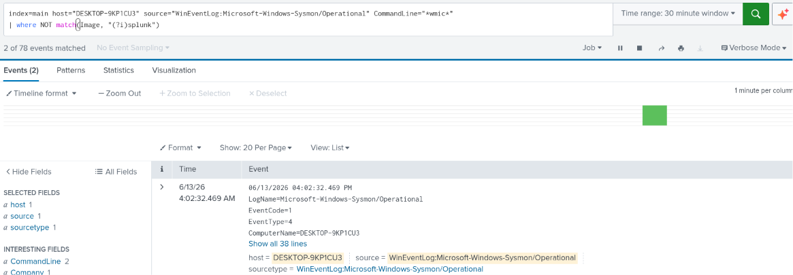
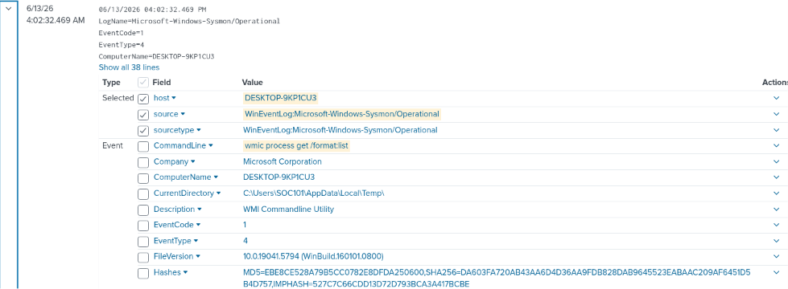
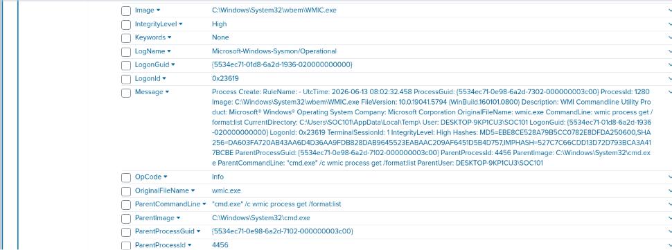
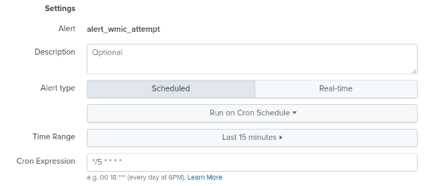
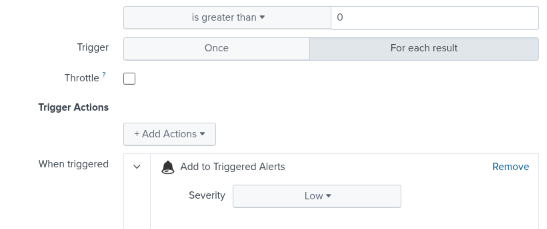

# test-05-wmic

# T1057-Process-Discovery

| Field | Details |
| --- | --- |
| **Date** | 2026-06-13 |
| **Test** | #5 - Process Discovery via wmic process |
| **Tactic** | Discovery |
| **Result** | Detected |

---

## 1. Test Overview

This test demonstrates process discovery using the legacy `wmic` command-line utility. Unlike Test 3 (`Get-Process`), which stayed entirely within PowerShell, this test spawns `cmd.exe` as an intermediate process, which then launches `WMIC.exe` to enumerate running processes. `wmic` is a Living-off-the-Land Binary (LOLBin) - a legitimate Windows tool that attackers commonly abuse since it's signed by Microsoft and often whitelisted.

---

## 2. Hypothesis

| Field | Expected |
| --- | --- |
| **Process** | WMIC.exe spawned by cmd.exe |
| **Parent chain** | powershell.exe → cmd.exe → WMIC.exe |
| **Command line** | wmic process get /format:list |
| **Event codes** | EventCode=1 (process creation) |

**Expected search:**

```
index=main host="DESKTOP-9KP1CU3"
source="WinEventLog:Microsoft-Windows-Sysmon/Operational"
EventCode=1 CommandLine="*wmic*"
```

---

## 3. Execution

| Field | Details |
| --- | --- |
| **Command** | `Invoke-AtomicTest T1057 -TestNumbers 5` |
| **Exit code** | 0 (success) |
| **Issues** | None |

---

## 4. What Splunk Found

| Field | Value |
| --- | --- |
| **Image** | C:\Windows\System32\wbem\WMIC.exe |
| **CommandLine** | wmic process get /format:list |
| **ParentImage** | C:\Windows\System32\cmd.exe |
| **ParentCommandLine** | "cmd.exe" /c wmic process get /format:list |
| **User** | DESKTOP-9KP1CU3\SOC101 |
| **CurrentDirectory** | C:\Users\SOC101\AppData\Local\Temp\ |
| **IntegrityLevel** | High |
| **Timestamp** | 2026-06-13 04:02:32.469 PM |
| **Event codes triggered** | EventCode 1 (process create) |

**Detection search:**

```
index=main host="DESKTOP-9KP1CU3"
source="WinEventLog:Microsoft-Windows-Sysmon/Operational" CommandLine="*wmic*"
| where NOT match(Image, "(?i)splunk")
```

**Screenshots:**

Query result:



Log detail:





---

## 5. Findings and Expectations

As hypothesized, `WMIC.exe` was spawned by `cmd.exe`, which itself was spawned by `powershell.exe`, the full three-link chain matched expectations. `CommandLine` confirmed `wmic process get /format:list`. As seen in Test 3, `CurrentDirectory` was again `AppData\Local\Temp`, reinforcing this as a recurring behavioral indicator across Atomic Red Team executions rather than a one-off.

---

## 6. Detection Rule

**Trigger logic:**

| Field | Value |
| --- | --- |
| **Image** | `*WMIC.exe*` |
| **ParentImage** | `*cmd.exe*` |
| **CommandLine** | `*wmic process*` |

**Detection search:**

```
index=main host="DESKTOP-9KP1CU3"
source="WinEventLog:Microsoft-Windows-Sysmon/Operational" EventCode=1
CommandLine="*wmic process*"
ParentImage="*cmd.exe*"
Image="*wmic*"
```

**False positive risk:**
Low-Medium: `wmic` is deprecated in modern Windows but still used in some legacy admin scripts and inventory tools. A `cmd.exe → wmic.exe` chain specifically querying `process` is less common than general `wmic` usage (e.g., `wmic product list` for software inventory), which narrows it somewhat.

**Alert name & severity:**

| Field | Value |
| --- | --- |
| **Name** | alert_wmic_attempt |
| **Severity** | Low |

> Alert scheduling follows lab standard (see README).
> 

**Screenshots:**

Alert config:





Alert triggered:


---

## 7. Cleanup

```powershell
Invoke-AtomicTest T1057 -TestNumbers 5 -Cleanup
```

---

## 8. Analyst Notes

The `cmd.exe → WMIC.exe` chain is functionally similar to Test 2's `cmd.exe → tasklist.exe` chain, both are legacy / old CLI tools spawned via cmd. The recurring `AppData\Local\Temp` CurrentDirectory across Tests 3 and 5 suggests this could be a useful pivot point for a broader detection rule: flagging *any* process creation where CurrentDirectory is AppData\Local\Temp AND the CommandLine contains discovery-related keywords such `process`, `tasklist`, `Get-`, `wmic`, regardless of which specific binary is used.
