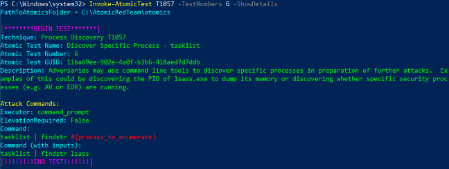
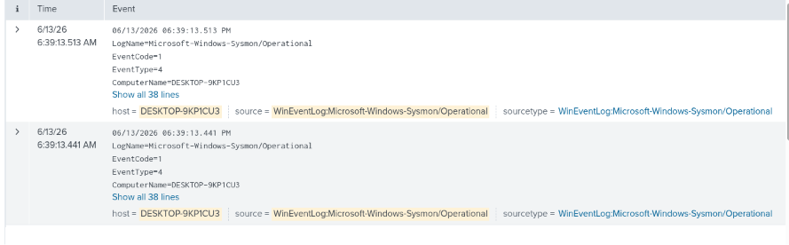
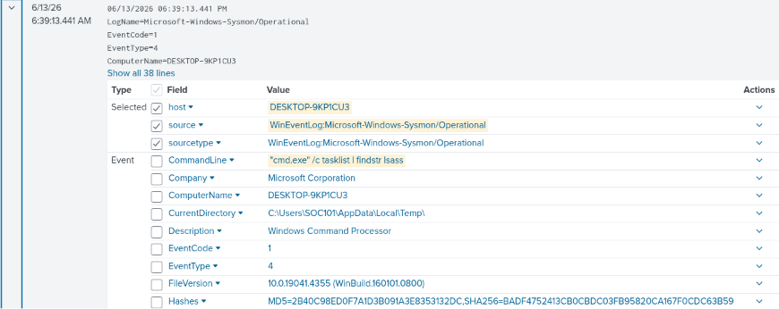
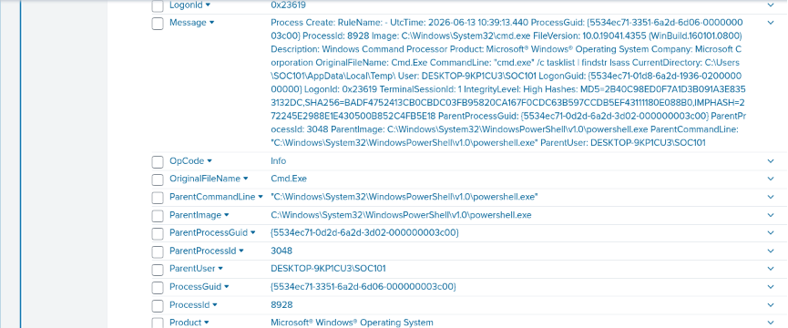
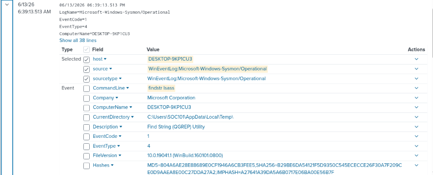
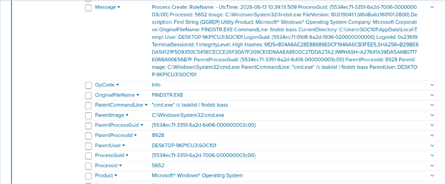
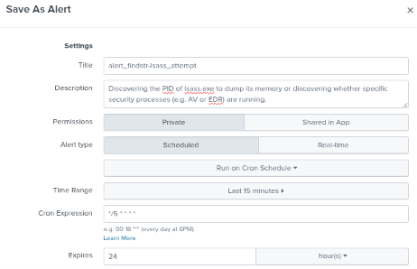
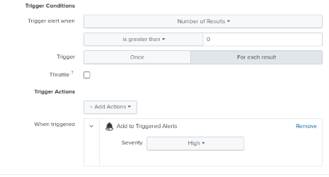

# test-06-lsass

# T1057-Process-Discovery

| Field | Details |
| --- | --- |
| **Date** | 2026-06-13 |
| **Test** | #6 - Discover Specific Process Name (tasklist | findstr lsass) |
| **Tactic** | Discovery |
| **Result** | Detected |

---

## 1. Test Overview

This test is different from the rest - instead of just listing every running process, it specifically searches for `lsass.exe`. The lsass.exe (Local Security Authority Subsystem Service) holds credentials in memory, so an attacker checking if it's running (and getting its PID) is usually a step before trying to dump it. Same `tasklist` binary as Test 2, but now the *intent* is different - this is not normal recon, bur rather, a targeted one.



*(revealed this after the analysis was done)*

---

## 2. Hypothesis

| Field | Expected |
| --- | --- |
| **Process** | tasklist.exe spawned by cmd.exe, same chain as test 2 |
| **Parent chain** | powershell.exe → cmd.exe → tasklist.exe |
| **Command line** | tasklist /FI "IMAGENAME eq lsass.exe" |
| **Event codes** | EventCode=1 (process creation) |

**Expected search:**

```
index=main host="DESKTOP-9KP1CU3" source="WinEventLog:Microsoft-Windows-Sysmon/Operational" CommandLine="*lsaas*" Image="*cmd.exe*" 
| where NOT match(Image, "(?i)splunk")
```

---

## 3. Execution

| Field | Details |
| --- | --- |
| **Command** | `Invoke-AtomicTest T1057 -TestNumbers 6` |
| **Exit code** | 0 (success) |
| **Issues** | None |

---

## 4. What Splunk Found

Two events were generated, not just one like I expected.

**Event 1 - cmd.exe (the pipeline)**

| Field | Value |
| --- | --- |
| **Image** | C:\Windows\System32\cmd.exe |
| **CommandLine** | "cmd.exe" /c tasklist | findstr lsass |
| **ParentImage** | C:\Windows\System32\WindowsPowerShell\v1.0\powershell.exe |
| **ParentCommandLine** | "C:\Windows\System32\WindowsPowerShell\v1.0\powershell.exe" |
| **CurrentDirectory** | C:\Users\SOC101\AppData\Local\Temp\ |
| **IntegrityLevel** | High |
| **ProcessId** | 8928 |
| **Timestamp** | 2026-06-13 06:39:13.441 PM |

**Event 2 - findstr.exe**

| Field | Value |
| --- | --- |
| **Image** | C:\Windows\System32\findstr.exe |
| **CommandLine** | findstr lsass |
| **ParentImage** | C:\Windows\System32\cmd.exe |
| **ParentCommandLine** | "cmd.exe" /c tasklist | findstr lsass |
| **ParentProcessId** | 8928 |
| **CurrentDirectory** | C:\Users\SOC101\AppData\Local\Temp\ |
| **IntegrityLevel** | High |
| **Timestamp** | 2026-06-13 06:39:13.513 PM |

**Event codes triggered:** EventCode 1 (process create) x2

**Detection search:**

```
index=main host="DESKTOP-9KP1CU3" source="WinEventLog:Microsoft-Windows-Sysmon/Operational" CommandLine="*findstr*" Image="*cmd.exe*"
| where NOT match(Image, "(?i)splunk")
```

**Screenshots:**

Query result:



Log detail (cmd.exe event):





Log detail (findstr.exe event):





---

## 5. Findings and Expectations

My hypothesis was wrong on two parts. First, the actual atomic command isn't `tasklist /FI "IMAGENAME eq lsass.exe"` like I guessed, its `tasklist | findstr lsass` - a pipe, not a filter flag. Second, and this is the part that confused me a bit, there's no separate `tasklist.exe` process creation event. What got logged is `cmd.exe` (carrying the full piped command in its CommandLine) and `findstr.exe` as its child. I think `tasklist` itself might not generate its own Sysmon event here because of how the pipe is handled by cmd, but the CommandLine on the cmd.exe event still proves `tasklist` was part of it.

Also CurrentDirectory is `AppData\Local\Temp` again - 4 out of the last 4 tests now.

---

## 6. Detection Rule

**Trigger logic:**

| Field | Value |
| --- | --- |
| **Image** | `*cmd.exe*` |
| **ParentImage** | `*powershell.exe*` |
| **CommandLine** | `*findstr*` |

**Detection search:**

```
index=main host="DESKTOP-9KP1CU3"
source="WinEventLog:Microsoft-Windows-Sysmon/Operational"
CommandLine="*findstr*" Image="*cmd.exe*" ParentImage="*powershell.exe*"
```

**False positive risk:**
Medium: `findstr` is a super common utility, used everywhere in scripts for filtering text output. The `cmd.exe` spawned directly from `powershell.exe` narrows it down a bit, but this query doesn't actually check for `lsass` specifically - so technically any `cmd /c ... | findstr ...` from a powershell parent would trigger this, not just lsass-targeted ones. Could probably tighten this further by adding `CommandLine="*lsass*"` if I wanted it specific to this exact technique.

**Alert name & severity:**

| Field | Value |
| --- | --- |
| **Name** | alert_findstr-lsass_attempt |
| **Severity** | High |
| **Description** | Discovering the PID of lsass.exe to dump its memory or discovering whether specific security processes (e.g. AV or EDR) are running. |

> Alert scheduling follows lab standard (see README). Expires after 24 hours.
> 

**Screenshots:**

Alert config:





Alert triggered:


---

## 7. Cleanup

```powershell
Invoke-AtomicTest T1057 -TestNumbers 6 -Cleanup
```

---

## 8. Takeaway

This is the first test where I marked severity as **High** instead of Low/Medium, and honestly it makes sense - the other tests are "is someone looking around" but this one is "someone is specifically looking for lsass," which is a pretty clear step toward credential dumping (T1003). Same `tasklist` binary as Test 2, but the target is what changes the risk level, not the tool. That's something I didn't really get until seeing it side by side - detection isn't just "what ran" but **what was it looking for.**

Also still thinking about that missing `tasklist.exe` event. Either Sysmon really doesn't log it separately when it's part of a pipe (cmd handles it differently), or it got filtered out somewhere in my search. Something to double check later, maybe by running `tasklist | findstr lsass` manually outside of Atomic and watching Splunk in real time.

5 out of 5 tests so far (3,4,5,6 - well, 4 out of 4 since test 2 didn't check this) all show `AppData\Local\Temp` as CurrentDirectory. At this point I'm fairly confident this is just "Atomic Red Team ran from here" and not a unique indicator of any specific technique - but it is a decent indicator of "Atomic ran on this host", which still has value.
