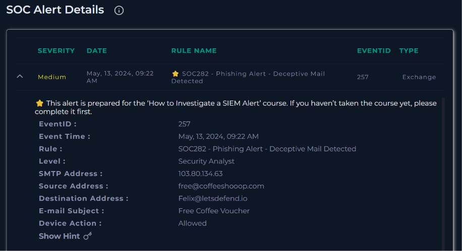
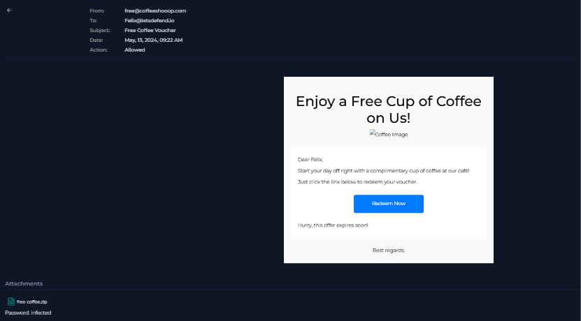
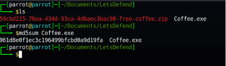
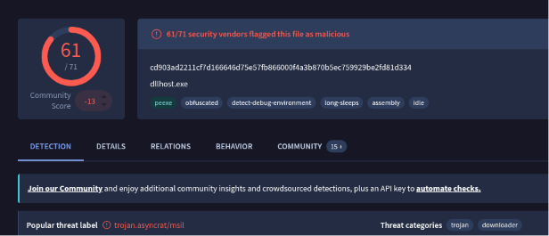
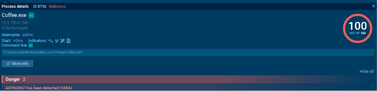
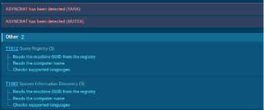
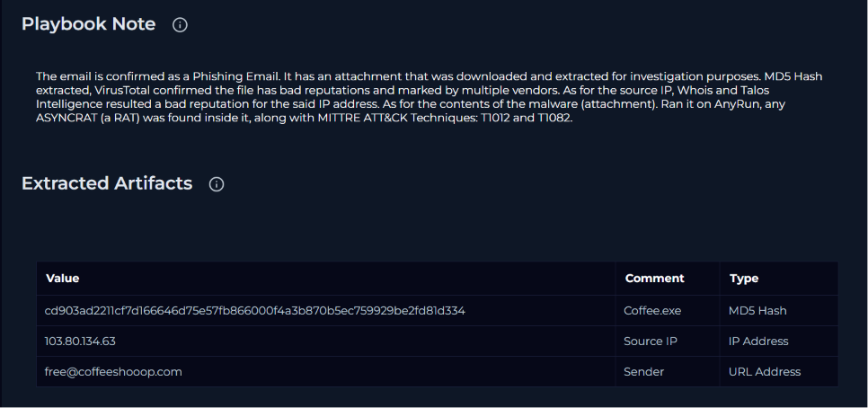

# SOC282 - Free Coffee Voucher Phishing (AsyncRAT)

Title: SOC282 - Phishing Alert: Deceptive Mail Detected

Platform: LetsDefend SOC Simulator

Link: [https://app.letsdefend.io/monitoring](https://app.letsdefend.io/monitoring)

Date: 06/14/2026

## Alert Summary

| Field | Value |
| --- | --- |
| Severity | Medium |
| Event ID | 257 |
| Rule | SOC282 - Phishing Alert - Deceptive Mail Detected |
| Type | Exchange |
| Alert Date | May 13, 2024, 09:22 AM |
| Device Action | Allowed |

## Analysis

### Phase 1: Email Triage

Starting from the SOC alert, I pulled the primary details of the email: the SMTP/source IP `103[.]80[.]134[.]63`, the sender `free@coffeeshooop[.]com`, the recipient `Felix@letsdefend.io`, and the subject line "Free Coffee Voucher."

Opening the email content showed a "Free Coffee" promotion with a "Redeem Now" button and a line reading "Hurry, this offer expires soon!" at the bottom, a classic urgency tactic to pressure the recipient into clicking without thinking. The email also carried a password-protected attachment, `free-coffee.zip`.

Before touching the attachment, I checked the artifacts I already had. The source IP `103[.]80[.]134[.]63` came back with a bad reputation on both Talos Intelligence and WHOIS. The sender domain `coffeeshooop[.]com` didn't return any hits on reputation tools, likely because it's a domain created specifically for this lab, but combined with the urgency and free-gift premise, the email was already behaving like a phishing lure.

### Phase 2: Attachment Analysis

To handle the attachment safely, I spun up an isolated VM, grabbed the actual download link for the zip via browser DevTools, and downloaded/extracted it inside the VM rather than on the host. The archive was password protected (password: `infected`), and extracting it revealed a single executable, `Coffee.exe`.

Running `md5sum` on the binary gave a hash of `961d8e0f1ec3c196499bfcbd0a9d19fa`. I submitted this to VirusTotal, which flagged the file as malicious with 61 of 71 vendors detecting it, tagging it under the popular threat label `trojan.asyncrat/msil` and categorizing it as a trojan/downloader.

### Phase 3: Behavioral Analysis

To confirm what the binary actually does, I detonated it in AnyRun. The sandbox flagged the process with a maximum risk score of 100/100 and identified AsyncRAT, a Remote Access Trojan, via both YARA signature and mutex detection.

The sandbox also mapped two MITRE ATT&CK techniques tied to reconnaissance behavior: T1012 (Query Registry), where the sample read the machine GUID, computer name, and checked supported languages from the registry, and T1082 (System Information Discovery), which covered the same set of actions from a discovery standpoint.

### Phase 4: Network Traffic Review

AnyRun recorded outbound connections to hosts in the United States and the Netherlands, but DNS resolutions were clean and the request/response content showed no active C2 activity. These are likely sandbox or OS telemetry noise common in AsyncRAT detonations, so they were excluded from the IOC list as unconfirmed indicators.

## Playbook & Alert Answers

| Question | Answer |
| --- | --- |
| Are there attachments or URLs in the email? | Yes |
| Check if mail delivered to user? | Delivered |
| Check if someone opened the malicious file/URL? | Opened |
| Analyze URL/Attachment | Malicious |
| Is this alert True Positive or False Positive? | True Positive |

**Alert Note:** Phishing Email Detected and Malware Analyzed.

**Playbook Note:**  The email is confirmed as a Phishing Email. It has an attachment that was downloaded and extracted for investigation purposes. MD5 Hash extracted, VirusTotal confirmed the file has bad reputations and marked by multiple vendors. As for the source IP, Whois and Talos
Intelligence resulted a bad reputation for the said IP address. As for the contents of the malware (attachment). Ran it on AnyRun, any ASYNCRAT (a RAT) was found inside it, along with MITTRE ATT&CK Techniques: T1012 and T1082.

## Indicators of Compromise (IOCs)

| **Indicator** | **Type** | **Description / Context** |
| --- | --- | --- |
| `103[.]80[.]134[.]63` | IPv4 | Sender SMTP IP, flagged on Talos & WHOIS |
| `free@coffeeshooop[.]com` | Email Address | Phishing sender address |
| `free-coffee.zip` | File Name | Password-protected malicious attachment (password: `infected`) |
| `Coffee.exe` | File Name | Dropped AsyncRAT payload |
| `961d8e0f1ec3c196499bfcbd0a9d19fa` | MD5 Hash | Hash of `Coffee.exe` |
| `cd903ad2211cf7d166646d75e57fb866000f4a3b870b5ec759929be2fd81d334` | SHA256 Hash | VirusTotal hash for the sample |
| AsyncRAT | Malware Family | Remote Access Trojan identified via YARA/mutex in AnyRun |
| T1012, T1082 | MITRE ATT&CK | Query Registry, System Information Discovery |
