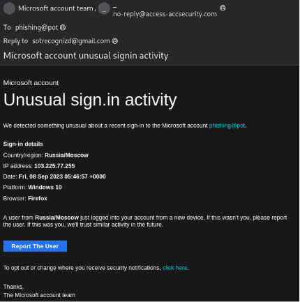
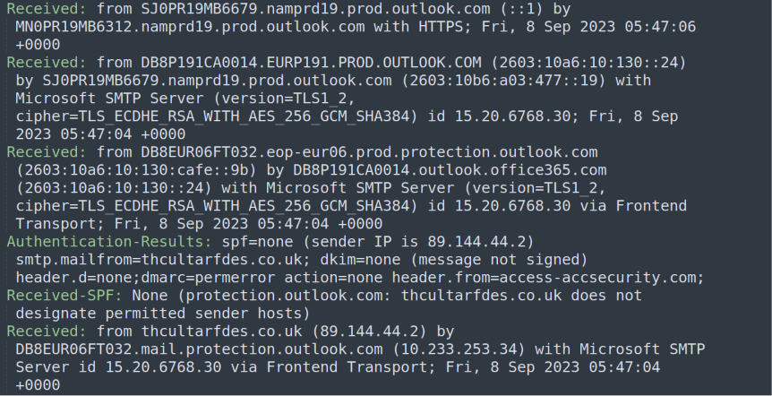
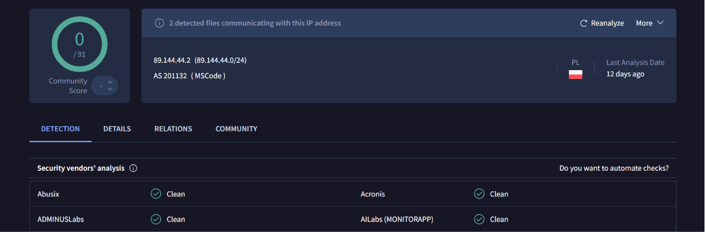
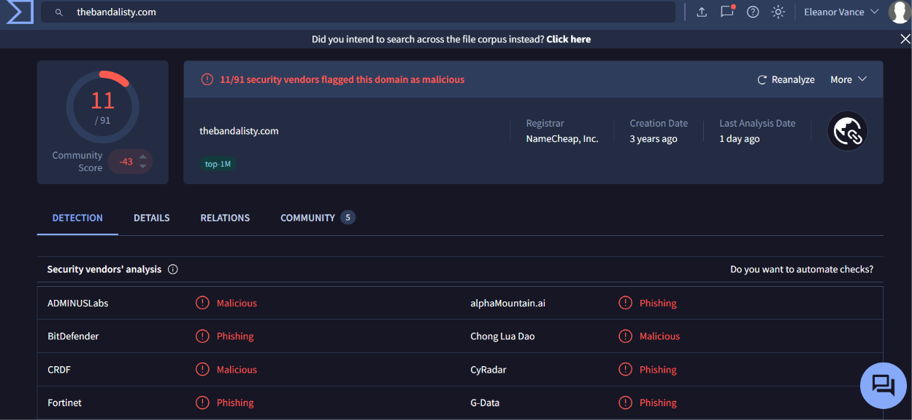
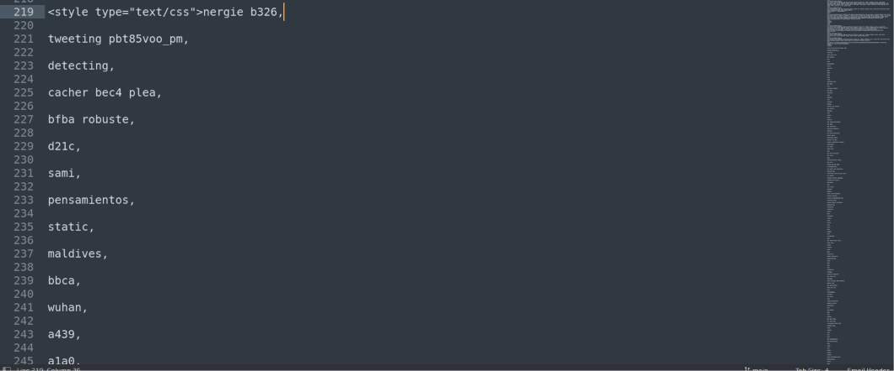

# Microsoft Account Spoofing Phishing Analysis

Title: Phishing Analysis: Microsoft Account Unusual Sign-in Activity

Platform: Real-world Honeypot Sample

Source: [https://github.com/rf-peixoto/phishing_pot](https://github.com/rf-peixoto/phishing_pot)

Date: 06/17/2026

---

## Executive Summary

This email impersonated a Microsoft account security alert to trigger an emotional response and drive a click. Header analysis revealed a spoofed sender, a Reply-To redirecting to a personal Gmail address, and complete SPF/DKIM/DMARC failure. The HTML body contained a tracking pixel for passive reconnaissance and a Bayesian poisoning block designed to evade spam filters. No attachments or embedded malware were present, the entire attack surface lived in headers and HTML.

---

## Case Summary

| Field | Value |
| --- | --- |
| Severity | Medium |
| Type | Phishing / Brand Impersonation |
| Email Date | Fri, 8 Sep 2023 05:47:04 +0000 |
| Sender (Display) | Microsoft account team |
| Sender (Actual) | `no-reply@access-accsecurity[.]com` |
| Recipient | `phishing@pot` - *default from the repo* |
| Subject | Microsoft account unusual signin activity |
| Source | Real-world Honeypot |

---

## Analysis

### Phase 1: Email Triage

I started by pulling the primary artifacts from the email headers. The display name presents itself as "Microsoft account team," but the actual sending address is `no-reply@access-accsecurity[.]com`, a domain visually copying Microsoft's legitimate `account.microsoft.com` infrastructure but clearly not affiliated with it.

Two additional header fields immediately raised flags: the `Reply-To` was set to `sotrecognizd@gmail[.]com`, and the `Return-Path` pointed to `bounce@thcultarfdes[.]co[.]uk`. An official Microsoft notification would never route replies to a personal Gmail address or return bounces to an unrelated UK domain.

The email content impersonated a Microsoft security alert, warning the recipient of unusual sign-in activity from Russia/Moscow, IP address `103[.]225[.]77[.]255`, on a Windows 10 device using Firefox. It presented a "Report The User" button, a social engineering tactic designed to provoke an immediate, emotional response from the recipient by making them feel their account is under threat.



There were no attachments in this email. The malicious infrastructure was embedded directly within the HTML body.

---

### Phase 2: Header & Authentication Analysis

To reconstruct the delivery path, I read the `Received` chain from bottom to top, as each hop is prepended by the receiving server.

**Originating hop:**

```
Received: from thcultarfdes.co.uk (89.144.44.2) by
DB8EUR06FT032.mail.protection.outlook.com (10.233.253.34)
with Microsoft SMTP Server; Fri, 8 Sep 2023 05:47:04 +0000
```

The actual origin is `thcultarfdes[.]co[.]uk` at IP `89[.]144[.]44[.]2`, which handed the message off to Microsoft's own mail protection infrastructure. This is the earliest point of entry and the true source of the email.

The authentication results confirmed the email failed all three standard checks:

- **SPF:** None, `thcultarfdes[.]co[.]uk` does not designate permitted sending hosts, meaning the domain has no SPF record authorizing this IP to send on its behalf.
- **DKIM:** None, the message was not cryptographically signed.
- **DMARC:** permerror, a permanent error, indicating the DMARC policy could not be evaluated, likely because the domain lacks a properly configured record.

> **Analyst note:** a clean SPF result does not guarantee legitimacy. If a threat actor registers a domain and publishes an SPF record authorizing their own sending infrastructure, the email can pass SPF while still being malicious. Authentication checks validate technical configuration, not **intent**.

Running `89[.]144[.]44[.]2` through VirusTotal returned a clean verdict from all 91 vendors, though the platform noted 2 detected files communicating with this address. The clean IP reputation is likely a result of the sample's age, this email is from September 2023, and the IP may have rotated or aged out of active threat feeds since then.





---

### Phase 3: HTML Body Analysis

Inspecting the raw HTML of the email revealed two notable techniques beyond the social engineering content.

**Tracking Pixel**

Embedded at the bottom of the HTML body:

```html

```

This is a tracking pixel, a 1×1 invisible image that fires an HTTP GET request to the attacker's server the moment the email is opened. The server logs the victim's IP address, timestamp, and User-Agent string, giving the attacker passive reconnaissance data without any interaction beyond opening the email.

Running `thebandalisty[.]com` through VirusTotal flagged it as malicious by 11 of 91 vendors, with detections spanning multiple vendors categorizing it as phishing and malicious.



**Bayesian Poisoning**

The HTML also contained a large block of randomized, comma-separated words injected into a hidden CSS style block:

```html
<style type="text/css">nergie b326, tweeting pbt85voo_pm, detecting, cacher bec4 plea, bfba robuste, d21c, sami, pensamientos, static, maldives, bbca, wuhan, a439, a1a0...
```

This technique, known as Bayesian poisoning, floods the email with statistically normal-looking text to manipulate the token frequency models used by spam filters and ML-based detection engines. By inflating the word count with innocuous terms, the attacker skews the content fingerprint of the email away from known phishing patterns, improving its chances of bypassing automated filtering.



---

## Indicators of Compromise (IOCs)

| **Indicator** | **Type** | **Description / Context** |
| --- | --- | --- |
| `no-reply@access-accsecurity[.]com` | Email Address | Spoofed sender impersonating Microsoft |
| `sotrecognizd@gmail[.]com` | Email Address | Reply-To address, redirects victim responses to attacker-controlled inbox |
| `bounce@thcultarfdes[.]co[.]uk` | Email Address | Return-Path, reveals true sending infrastructure |
| `thcultarfdes[.]co[.]uk` | Domain | Originating sender domain, SPF/DKIM/DMARC all failed |
| `89[.]144[.]44[.]2` | IPv4 | Originating sender IP (AS201132, MSCode, Poland) |
| `thebandalisty[.]com` | Domain | Tracking pixel host, flagged malicious by 11/91 VirusTotal vendors |
| `http://thebandalisty[.]com/track/o43062rdzGz18708448Gdrw1821750fYo33632dSjh176` | URL | Tracking pixel endpoint embedded in email HTML |
| `103[.]225[.]77[.]255` | IPv4 | Fictitious sign-in IP displayed in email body to deceive recipient |
